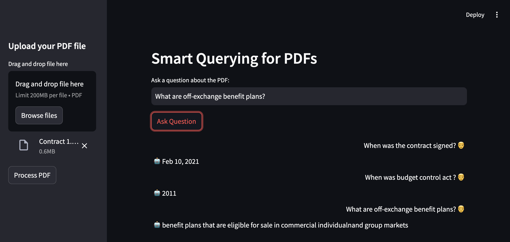

# Smart Querying for PDFs

## Introduction

This application provides a interface for querying a pdf file smartly .It performs detailed text extraction from pdf using tessaract and preprocessing, including text cleaning and segmentation into manageable chunks. These chunks are embedded using the sentence-transformers/all-mpnet-base-v2 model and stored in a FAISS vector database for efficient similarity searches. Users can input queries related to the PDF content, with responses generated by the t5-large model, which synthesizes information from relevant text chunks to deliver precise answers. 

## Project Flow


### 1. Extracting Text from PDF Files

1.	**Convert PDF Pages to Images:**
The first step involves converting each page of the PDF into an image. PDFs are often composed of scanned images, so converting them into images allows us to use Optical Character Recognition (OCR) to extract the text. Each page of the PDF is read and transformed into a separate image for further processing.
2.	**Prepare Images for Text Extraction:**
Once we have the images, the next step is to preprocess them to improve OCR accuracy. This involves applying binarization, a technique that converts the image into a high-contrast binary format. This makes the text stand out against the background, enhancing OCR performance. The binarization is done using the following mathematical function:

$$
T(x, y) = 
\begin{cases} 
255 & \text{if } I(x, y) \geq T \\
0 & \text{if } I(x, y) < T
\end{cases}
$$

Here,  T(x, y)  represents the thresholded pixel value,  I(x, y)  is the original pixel value, and  T  is the threshold value.

4.	**Perform Optical Character Recognition (OCR):**
With the preprocessed binary images, OCR technology is used to recognize and extract text. OCR analyzes the patterns in the image to identify characters and words, converting them into readable text.
5.	**Combine Text from All Pages:**
After extracting text from each image, the text from all pages is compiled into a single block of text. This ensures that all content from the PDF is captured and preserved in the correct sequence.

### 2. Processing the Text

1.	**Chunking the Text:**
To manage the text efficiently, it is divided into smaller chunks. Each chunk is typically about 500 characters long, with an overlap of 200 characters between consecutive chunks. This overlap ensures that important context is not lost between chunks.
2.	**Creating Embeddings:**
Each text chunk is converted into a numerical representation known as an embedding. This process translates text into a vector of numbers that capture its semantic meaning. The embeddings are generated using a pre-trained model, such as the sentence-transformers/all-mpnet-base-v2 model from HuggingFace. The embeddings map each chunk to a high-dimensional space where similar meanings are represented by similar vectors.
3.	**Storing and Indexing Embeddings:**
The numerical embeddings are stored using FAISS, a library designed for efficient similarity search and clustering of high-dimensional vectors. FAISS enables quick retrieval and comparison of these embeddings, facilitating efficient search operations.
4.	**Session Management:**
The processed data, including text chunks and their embeddings, are stored in the application’s session state. This allows for quick access and retrieval during user interactions, ensuring that the system does not need to reprocess the data with each query.

### 3. Question Answering

1.	**Capturing the User’s Question:**
When the user submits a question, it is first checked to ensure that the question is provided and that the knowledge base is initialized. If these conditions are met, the question is added to the chat history.
2.	**Processing the Query:**
A loading spinner indicates that the system is processing the request. The user’s question is used to search the knowledge base for relevant information. The knowledge base contains embeddings of text chunks extracted from the PDF, enabling quick similarity searches.
3.	**Finding Relevant Documents:**
The system retrieves the top 3 documents from the knowledge base that are most similar to the user’s question. These documents are concatenated to form a context that provides relevant information for answering the question.
4.	**Cleaning and Preparing the Context:**
The context obtained from the retrieved documents is cleaned to remove irrelevant text. The cleaned context is combined with the user’s question to create a coherent input for the answer generation model.
5.	**Generating an Answer:**
The combined context and question are processed by a pre-trained model, such as “T5-large,” a transformer-based model designed for generating human-like text. The model produces an answer based on the provided context and question.
6.	**Updating the Chat History:**
The generated answer is added to the chat history, reflecting the interaction between the user’s question and the system’s response. This allows users to see the conversation flow.
7.	**Displaying the Conversation:**
The chat history is displayed with a clear distinction between user messages and bot responses. User messages are aligned to the right, and bot responses are aligned to the left, ensuring a readable and organized conversation.

### 4. Threshold-based Similarity Filtering
1. When a user asks a question, the system searches through the stored knowledge to find chunks of text that are similar to the question. The similarity_search_with_score function not only retrieves these chunks but also provides a similarity score for each one. This score represents how closely each chunk matches the user’s question.

2. In this process, the system loops through the retrieved chunks and checks their scores against a pre-defined threshold . If a chunk’s score meets this threshold, it’s considered relevant and added to the context variable. If none of the chunks have scores above the threshold, the system concludes that there’s “No match” for the query.

## Setup

python=3.9.19
1. Clone the respository 
```
git clone https://github.com/Ayush-Singh677/Smart-Querying-for-PDFs.git
```
2. Enter into the repo directory
```
cd Smart-Querying-for-PDFs
```
3. Create a virtual environment
```
python -m venv chat
```
4. Activate the envirnment for Windows
```
.\chat\Scripts\activate
```
5. Activate the envirnment for Windows
```
source chat/bin/activate
```
6. Install all the required libraries.
```
pip install -r requirements.txt
```

7. Download all the required models.
```
python3 download_models.py
```
8. Run the streamlit app.
```
streamlit run app.py
```
9. Upload the pdf file and ask your question.


   
10. After uploading uploading the document click on process pdf, it might take a minute or two to generate the embeddings for the chunks. Following this the embeddings will be stored in the session state and it would not require you to process document for the current session again and again. Then type the questions in the text bar and click ask questions.
## Resources 
```google-t5/t5-large``` - <a href="https://huggingface.co/google-t5/t5-large">Hugging Face<a/> <br>
```sentence-transformers/all-mpnet-base-v2``` - <a href="https://huggingface.co/sentence-transformers/all-mpnet-base-v2">Hugging Face<a/>
